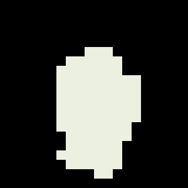
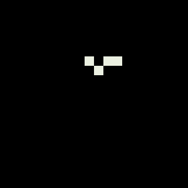
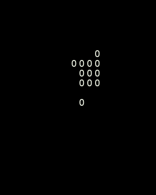
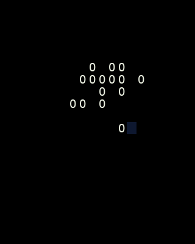
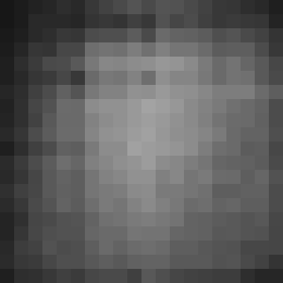
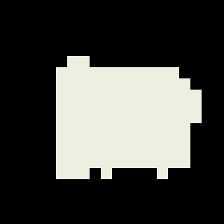
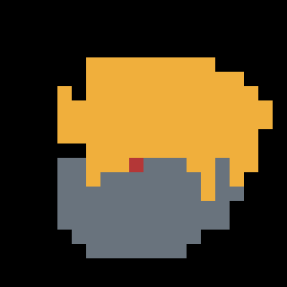
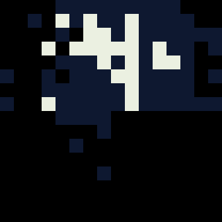
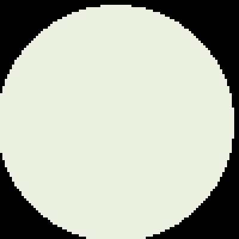
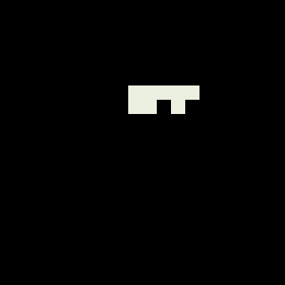

# Ten Jev frame experiments

Each numbered folder contains exactly `io.jsonl` and `image.png`. Images are enlarged for viewing with nearest-neighbor scaling. Glyph images use Menlo. Every request includes its exact instructions and choices; responses retain probabilities and token usage. No returned art decisions were corrected locally.

Nine tests request a front-facing owl with two bright eyes, a beak, ear tufts, rounded body, wings and feet. The coordinate control requests a prescribed disk. Each approach was run once, with different output vocabularies and query counts; these are exploratory observations rather than a controlled model benchmark.

## Results

| Experiment | Logical canvas | Requests | Answers | Result |
|---|---|---:|---:|---|
| [Binary silhouette](00_binary-silhouette/image.png) | 20×20 | 9 | 400 | Solid white mass, without separated owl features. |
| [Direct palette](01_direct-palette/image.png) | 20×20 | 9 | 400 | Small white patch; remaining cells black. |
| [ASCII glyphs](02_ascii-glyphs/image.png) | 20×20 cells | 9 | 400 | Cluster of capital O glyphs. |
| [ANSI cells](03_ansi-cells/image.png) | 20×20 cells | 25 | 1200 | Cluster of O glyphs with one visible navy background cell. Styles and the full Unicode repertoire were not tested. |
| [Probability field](04_probability-field/image.png) | 20×20 | 9 | 400 | Diffuse grayscale field. Probabilities are confidence values repurposed as brightness. |
| [Coordinate control](05_coordinate-control/image.png) | 20×20 | 9 | 400 | 345/400 cells correct (86.25%); 55 incorrect. Tests coordinate following, not original composition. |
| [Semantic regions](06_semantic-regions/image.png) | 20×20 | 9 | 400 | Large joined gold region above gray region, small red area. |
| [Adaptive tiles](07_adaptive-tiles/image.png) | 32×32 | 10 | 309 | Fragmented white/navy regions; five tree levels. |
| [Sequential commands](08_sequential-commands/image.png) | 100×100 | 24 | 144 | Same ellipse center and extents in all 24 commands. First 19 black, final five white. Geometry chosen entirely by Jev; renderer supplies rasterization. |
| [Grid revision](09_grid-revision/image.png) | 20×20 | 9 | 400 | White patch changed shape; no recognizable owl emerged. |

## Images and output contracts

### 00_binary-silhouette: Binary silhouette

One of owl/background per cell; fixed white/black display.



[Exact IO](00_binary-silhouette/io.jsonl)

### 01_direct-palette: Direct palette

One of eight named colors per pixel.



[Exact IO](01_direct-palette/io.jsonl)

### 02_ascii-glyphs: ASCII glyphs

One of 21 characters per cell; fixed white foreground and black background.



[Exact IO](02_ascii-glyphs/io.jsonl)

### 03_ansi-cells: ANSI cells

Separate choices for glyph, foreground, background. Truecolor escape string preserved in the JSONL.



[Exact IO](03_ansi-cells/io.jsonl)

### 04_probability-field: Probability field

Yes probability mapped directly to round(255*p) grayscale.



[Exact IO](04_probability-field/io.jsonl)

### 05_coordinate-control: Coordinate control

Choose white iff (x-9.5)^2+(y-9.5)^2 <= 49, otherwise black. Formula supplied by harness.



[Exact IO](05_coordinate-control/io.jsonl)

### 06_semantic-regions: Semantic regions

Choose background/body/wing/eye/pupil/beak/foot/ear; fixed region-to-color table disclosed in input.



[Exact IO](06_semantic-regions/io.jsonl)

### 07_adaptive-tiles: Adaptive tiles

Choose a uniform tile color or subdivide into quadrants; stop splitting at 2×2.



[Exact IO](07_adaptive-tiles/io.jsonl)

### 08_sequential-commands: Sequential commands

24 commands; separate shape/color/center/extent choices; full prior command history in each request. Generic raster primitives paint in order.



[Exact IO](08_sequential-commands/io.jsonl)

### 09_grid-revision: Grid revision

Choose all colors anew with experiment 1's complete returned grid in context.



[Exact IO](09_grid-revision/io.jsonl)

## Validation and replay

All ten images reproduced byte-for-byte from saved responses with HTTP disabled. Every answer key and Choice value was checked against its request. Every run has exactly two files, and the current API key is absent from each log. Validation receipts are appended to the corresponding JSONL.

```bash
python3 scripts/28_jev_experiments.py --offline
```

Output strings containing ANSI escapes are stored as JSON data; the experiment runner does not execute them in a terminal. This run did not modify Rust modes or exercise terminal playback.

Total: 122 requests, 4453 answers; 520,993 input tokens and 363,663 output tokens reported by the API.
