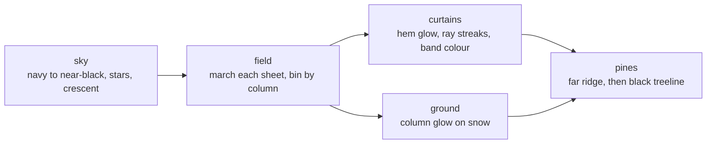

# aurora2

Folded curtains of northern light over a black pine ridge, with the snow below lit
by whatever colour the sky is throwing at it. Registered trait mode, `src/modes/_56_aurora2.rs`.

- [What it draws](#what-it-draws)
- [Knobs](#knobs)
- [Naming](#naming)
- [Knob sweep, 2000x1000](#knob-sweep-2000x1000)
- [Hotspots at the worst knob](#hotspots-at-the-worst-knob)
- [Layer coverage](#layer-coverage)

## What it draws

A curtain is a sheet, not a smear. `march` walks the sheet in plan view, displaces
it sideways by a three-octave fold field, and bins each step into the screen column
it lands in. Where the sheet folds back on itself two arms land in the same column
and the density adds: that caustic is the bright vertical pleat a real curtain shows.
The march also carries a hem row, a depth, and a high-frequency ray value, so every
column comes out of one pass with everything the paint needs.

Vertically the profile is a sharp gaussian cut below the hem, a bright rim one row
deep at the hem, and a `(1 - u)^1.4` fade to the crown. `FOLD` darkens the sheet
between ray columns and brightens the ray columns themselves, which is what turns a
flat wash into streaks. Brightness runs through a Reinhard shoulder, so hems pin near
the top of the ramp and nothing clips to white.

Colour is a height band, not a hue angle: green 133 for the lower 45 percent, then
green to pink 318, then pink to violet 268 at the crown, mixed in rgb so the walk
never detours through yellow. `band_table` quantises that into 24 bands by 16 levels
once per frame; the per-cell paint is an index.

`frame.time` offsets the fold field, breathes the hems, and turns the star twinkle.
`t = 0` is the static frame by construction. Star phases come from
`side_rng(seed, 2, index)`, curtains from `side_rng(seed, 1, index)`, pines from
`side_rng(seed, 3, index)`, the moon from `side_rng(seed, 9, 0)`, so no knob shifts a
neighbour's stream. The treeline never consumes `t`: the crest row is identical at
every clock.

## Knobs

| key | label | range | default |
| --- | --- | --- | ---: |
| `RIBBONS` | curtain count | 1 to 16 | 5 |
| `RWIDTH` | curtain width in columns | 2 to 30 | 7 |
| `DRIFT` | flow drift speed | 0 to 4 | 1.0 |
| `HORIZON` | horizon height fraction | 0.3 to 0.95 | 0.72 |
| `STARS` | star density | 0 to 3 | 1.0 |
| `SPREAD` | hue reach green to violet | 0 to 2 | 1.0 |
| `PINES` | treeline density | 0 to 3 | 1.0 |
| `FOLD` | ray contrast | 0 to 2 | 1.0 |
| `GAIN` | curtain brightness | 0.2 to 2.5 | 1.0 |

Positional CLI args follow that order:
`cargo run -- <seed> aurora2 <theme> [ribbons] [width] [drift] [horizon] [stars] [spread] [pines] [fold] [gain]`

## Naming

The name `aurora` was already taken by the mode in `src/cli_scenes.rs:883` (box-drawing
bands over a snowfield, committed with a golden snapshot). The repo rule is "never
remove or break existing modes, only add", so this one ships as `aurora2`. Both
render; nothing about the old mode changed.

## Knob sweep, 2000x1000

`perf/knob_sweep.sh aurora2 2000 1000 2`, theme moss, dt 0.06, release.

| knob at max | frames | fps | avg ms | p50 ms | p99 ms | max ms | vs baseline |
| --- | ---: | ---: | ---: | ---: | ---: | ---: | ---: |
| baseline | 224 | 74.6 | 13.40 | 13.24 | 16.11 | 17.85 | 1.00x |
| RIBBONS=16 | 115 | 38.1 | 26.25 | 25.74 | 31.14 | 38.37 | 1.96x |
| RWIDTH=30 | 164 | 54.5 | 18.34 | 18.05 | 21.69 | 26.71 | 1.37x |
| HORIZON=0.95 | 212 | 70.4 | 14.21 | 13.95 | 17.17 | 19.33 | 1.06x |
| GAIN=2.5 | 215 | 71.4 | 14.00 | 13.68 | 19.79 | 23.44 | 1.04x |
| DRIFT=4 | 216 | 71.8 | 13.93 | 13.57 | 18.98 | 22.42 | 1.04x |
| STARS=3 | 220 | 73.0 | 13.69 | 13.44 | 17.31 | 19.38 | 1.02x |
| PINES=3 | 222 | 73.7 | 13.56 | 13.41 | 15.78 | 18.87 | 1.01x |
| FOLD=2 | 229 | 76.1 | 13.13 | 12.83 | 17.28 | 19.10 | 0.98x |
| SPREAD=2 | 231 | 76.9 | 13.01 | 12.77 | 16.13 | 17.44 | 0.97x |

Baseline moved 19.6 to 74.6 fps against the pre-port renderer: the sky, field, curtain
and ground passes all run `par_chunks_mut(w)` above 20_480 cells now. Run the sweep
twice; the baseline row is the first measured and eats the warm-up otherwise.

`RIBBONS` and `RWIDTH` both scale `field` directly: one multiplies the number of
sheet marches, the other the column span each march touches. Nothing else moves the
frame more than 6 percent: the sky, ground and pine passes are fixed work per cell,
and `FOLD` and `SPREAD` only change what the paint pass writes, not how much.

## Hotspots at the worst knob

`RIBBONS=16`, 100 frames, 33.0 fps.

| layer | calls/frame | avg us | max us | share of frame |
| --- | ---: | ---: | ---: | ---: |
| field | 1.0 | 21925.6 | 32150.0 | 72.4% |
| ground | 1.0 | 3604.4 | 7879.8 | 11.9% |
| sky | 1.0 | 1618.6 | 2999.9 | 5.3% |
| curtains | 1.0 | 1553.0 | 3920.3 | 5.1% |
| pines | 1.0 | 594.0 | 860.5 | 2.0% |

## Layer coverage

Five timers, 96.7 percent of the frame attributed (sum of the hotspot table above).

| layer | what it covers |
| --- | --- |
| sky | gradient fill, stars, crescent moon |
| field | one `march` per curtain, then the row pass that lights the sky buffer |
| curtains | band table build and the glyph/colour resolve |
| ground | column glow and the snowfield |
| pines | far ridge silhouette, then the black treeline |

`perf/layer_coverage.sh 400 120 3 moss aurora2` reports nothing: that harness walks
`perf_sweep.rs` `NATIVE_MODES`, which a registered trait mode is deliberately absent
from. The registry gate `every_registered_mode_that_renders_in_process_has_layer_timers`
is what proves the timers exist; the knob sweep above is what reports their share.

At a real terminal size the whole frame is cheap: the in-module `frame_cost` test
renders 200 frames at 200x60 and holds under the 6 ms release budget.
