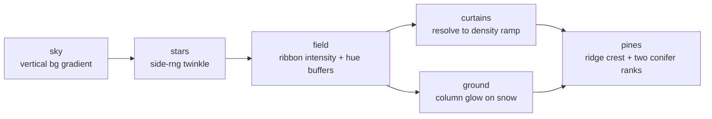

# aurora2

Flow-field curtains of northern light over a pine horizon, with the snow below lit
by whatever colour the sky is throwing at it.

- [What it draws](#what-it-draws)
- [Knobs](#knobs)
- [Naming](#naming)
- [Knob sweep, 2000x1000](#knob-sweep-2000x1000)
- [Hotspots at the worst knob](#hotspots-at-the-worst-knob)
- [Layer coverage](#layer-coverage)

## What it draws

Each ribbon is a vertical curtain whose spine meanders through `pp_fbm` on the
vertical axis and whose brightness falls off as a gaussian around that spine. A
second noise term across the horizontal axis cuts the body into folds, which is
what makes the shape read as a hanging curtain rather than a smear. Intensity and
hue accumulate additively into two float buffers, so overlapping ribbons blend
before anything is committed to a cell. Hue walks green 130 to magenta 300 to cyan
190 along the curtain from hem to crown, scaled by `SPREAD`.

`t_anim` offsets the flow field and the star twinkle phases. `t = 0` is the static
frame by construction: the renderer is a pure function of `t`. Star phases come
from `side_rng(seed, 2, index)`, ribbons from `side_rng(seed, 1, index)`, pines
from `side_rng(seed, 3 + rank, index)`, so no knob shifts a neighbour's stream.

## Knobs

| key | label | range | default |
| --- | --- | --- | ---: |
| `RIBBONS` | curtain count | 1 to 16 | 5 |
| `RWIDTH` | curtain width in columns | 2 to 30 | 7 |
| `DRIFT` | flow drift speed | 0 to 4 | 1.0 |
| `HORIZON` | horizon height fraction | 0.3 to 0.95 | 0.72 |
| `STARS` | star density | 0 to 3 | 1.0 |
| `SPREAD` | hue spread green to cyan | 0 to 2 | 1.0 |
| `PINES` | treeline density | 0 to 3 | 1.0 |
| `FOLD` | ray contrast | 0 to 2 | 1.0 |
| `GAIN` | curtain brightness | 0.2 to 2.5 | 1.0 |

Positional CLI args follow that order:
`cargo run -- <seed> aurora2 <theme> [ribbons] [width] [drift] [horizon] [stars] [spread] [pines] [fold] [gain]`

## Naming

The name `aurora` was already taken by the mode in `src/cli_scenes.rs:883` (box-drawing
bands over a snowfield, committed with a golden snapshot). The repo rule is "never
remove or break existing modes, only add", so this one ships as `aurora2`. Both
render; nothing about the old mode changed.

## Knob sweep, 2000x1000

`perf/knob_sweep.sh aurora2 2000 1000 2`, theme moss, dt 0.06, release.

| knob at max | frames | fps | avg ms | p50 ms | p99 ms | max ms | vs baseline |
| --- | ---: | ---: | ---: | ---: | ---: | ---: | ---: |
| baseline | 40 | 19.6 | 51.12 | 50.62 | 56.53 | 57.30 | 1.00x |
| RIBBONS=16 | 17 | 8.4 | 119.11 | 119.10 | 119.99 | 120.79 | 2.33x |
| RWIDTH=30 | 18 | 9.0 | 111.46 | 111.32 | 112.24 | 112.40 | 2.18x |
| GAIN=2.5 | 21 | 10.4 | 96.15 | 90.10 | 124.63 | 186.99 | 1.88x |
| SPREAD=2 | 25 | 12.4 | 80.86 | 76.61 | 123.34 | 146.35 | 1.58x |
| PINES=3 | 26 | 12.9 | 77.76 | 77.09 | 112.09 | 113.63 | 1.52x |
| FOLD=2 | 28 | 13.7 | 72.75 | 71.15 | 103.32 | 110.69 | 1.42x |
| STARS=3 | 36 | 17.8 | 56.31 | 51.76 | 75.32 | 91.43 | 1.10x |
| DRIFT=4 | 40 | 19.9 | 50.24 | 50.08 | 52.32 | 55.11 | 0.98x |
| HORIZON=0.95 | 42 | 20.8 | 48.03 | 47.33 | 51.57 | 70.19 | 0.94x |

`RIBBONS` and `RWIDTH` both scale the work in `field` directly: one multiplies the
number of passes, the other the column span each pass touches. `GAIN` and `SPREAD`
cost because they push more cells over the `curtains` resolve threshold.

## Hotspots at the worst knob

`RIBBONS=16`, 13 frames, 6.2 fps.

| layer | calls/frame | avg us | max us | share of frame |
| --- | ---: | ---: | ---: | ---: |
| field | 1.0 | 93467.9 | 123624.9 | 57.8% |
| curtains | 1.0 | 33477.7 | 48776.1 | 20.7% |
| ground | 1.0 | 29260.5 | 49960.2 | 18.1% |
| pines | 1.0 | 2017.0 | 2649.2 | 1.2% |
| stars | 1.0 | 1604.7 | 2942.8 | 1.0% |
| sky | 1.0 | 598.0 | 1196.0 | 0.4% |

## Layer coverage

`perf/layer_coverage.sh 400 120 3`, release.

| mode | layers | calls/frame | attributed | thin | nested |
| --- | ---: | ---: | ---: | --- | --- |
| aurora2 | 6 | 6.0 | 98.3% | no | no |

At a real terminal size the whole frame is cheap: the in-module `frame_cost` test
renders 200 frames at 200x60 and holds under the 6 ms release budget.
