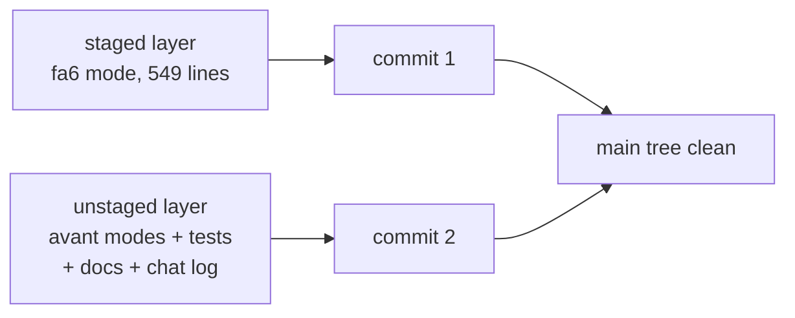
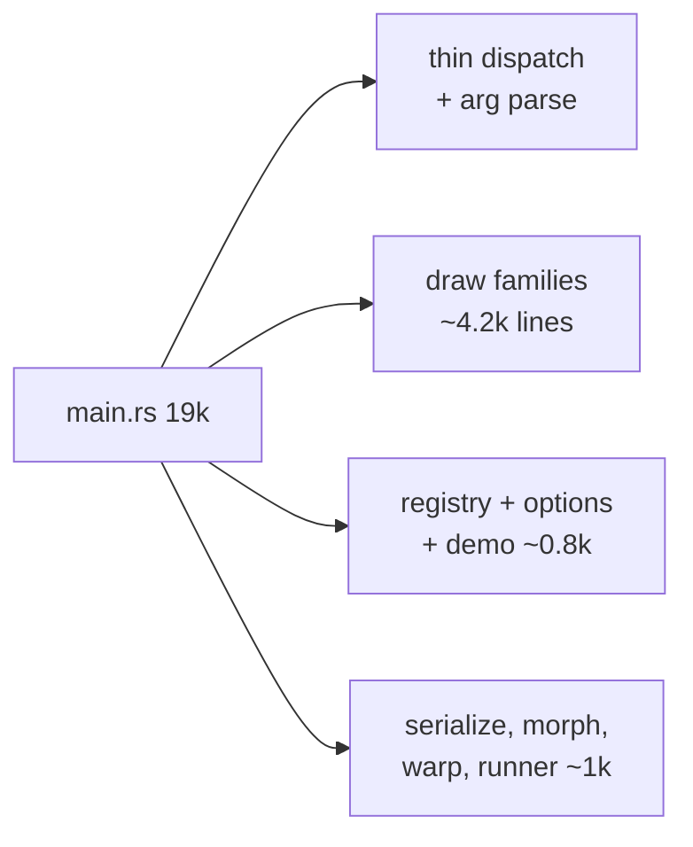

# Cleanup plan, plain words

Companion to `cleanup-plan.PLAN.md` (that one has the receipts). TOC:

1. What is dirty and why
2. What happens to each pile
3. Two ignore entries
4. Where snapshots live (settled)
5. The big main.rs (later)

## 1. What is dirty and why

The last few arcs (fa6 transmutation circle, the avant family, snakes knobs)
were written straight into the main tree and never committed. Nothing is
broken; it is all finished work sitting uncommitted in three layers.

## 2. What happens to each pile

| Pile | Call |
|---|---|
| fa6 work (staged half of main.rs) | commit first, on its own |
| avant.rs + murmuration/lanterns/tide + their tests | commit second |
| AGENTS.md + CLAUDE.md mode-list updates | commit with their code |
| chat log entry + LATEST.md pointer | commit together |
| 9 new snapshot files | commit with the tests that make them |
| 11 root design docs | move under docs/ (exec lane) |

Nothing gets discarded. Every dirty row is finished work that should land.

## 3. Two ignore entries

`.boop-worktrees/` and `lanes/` are tool scratch, not source. The exec lane
adds both to `.gitignore` so status stays readable.

## 4. Where snapshots live (settled)

Both directories are right. Unit tests keep snapshots beside the code,
integration tests keep them beside the test file. The one doc line that says
there is only one snapshot home is stale; the exec lane rewords it.

## 5. The big main.rs (later)

main.rs is 19k lines because a dozen mode families grew inside it while the
rest of the repo already split into siblings. The split moves the draw
families, the demo/options machinery, and the mode registry out to sibling
modules, the same move the tree/walker/sprite code already made.

Separate later arc, after the dirty tree lands. Mechanical risk only: shared
helpers become crate-visible.
