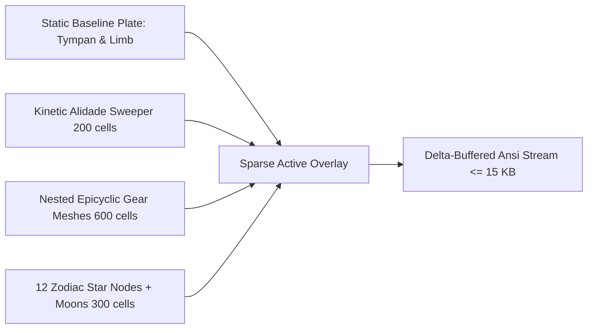
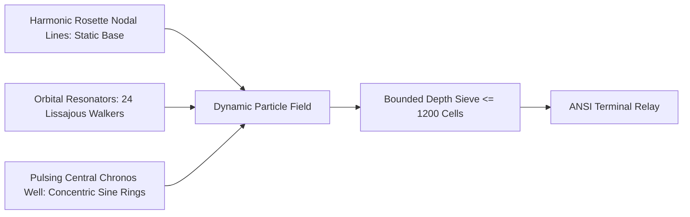

# Gemini 3.8 Flash creative review and implementation checks

Requested through Boop preset `gem38f`, opencode, variant `max`, reviewing public
commit `c36cbae`. Lane `chore-gem3-creative-review` completed successfully. The
original review follows these checks; it is a design proposal, not benchmark evidence.

## Implementation checks by Codex

- The proposed byte counts, CPU times and frame rates are unmeasured estimates.
  Moving marks can change both their old and new cells. Actual cursor, color and
  UTF-8 payloads must be checked with the existing encoder. At 0.95 MB/s, 20 KB
  at 60 frames/s would exceed the observed user-run throughput.
- `SmallVec<[T; 2048]>` sets inline capacity, not a hard size bound. The proposed
  maximum rings plus bodies can exceed it. A real total sample budget is needed.
- The draft pseudocode collects z values but its final loop does not compare or
  sort them. An implementation needs actual depth ordering or a depth buffer.
- Zodiac glyphs can occupy two columns. Use verified one-column symbols or the
  existing reserved-column handling; font assumptions are insufficient.
- Gem 3's five-cell core does animate. Its limited visual prominence is the
  relevant distinction from the diameter-spanning sighting arm in Gem 1/2.

These checks supersede corresponding assertions in the draft below. A correction
request was queued after the lane retired; no corrected Gemini response was received.

---

# Creative Review: gem-aetherium-3

## 1. Concrete Visual and Motion Mechanisms in Gem 1/2 Missing from Gem 3

Gem 1 (`_34_gemini_astrolabe.rs`) and Gem 2 (`_50_gem_aetherium_2.rs`) convey a sense of cosmic depth, dense mechanical articulation, and sacred astronomical geometry. Gem 3 (`_52_gem_aetherium_3.rs`) replaced dynamic 3D projection, depth sorting, and rich celestial symbology with flat 2D static rosettes, ASCII letters, and a meager budget of 249 moving cells.

Specific missing mechanisms:

| Mechanism | Gem 1 / 2 Implementation | Gem 3 Implementation & Absence | Visual Consequence |
|---|---|---|---|
| **True 3D Pitch/Yaw Gimbaling** | `rotate_3d` + `project` with aspect correction (`aspect = 2.05`, `fov = scale * 2.8`). Rings pitch dynamically: `cur_pitch = base_pitch + (anim_t * 0.4 + r).sin() * 0.25 * tilt`. | Flat 2D ellipse flattening: `flatten = 0.28 + (1.0 - tilt) * 0.52`, static per ring angle `turn = phase + ring * PI / rings`. | Rings do not roll or tumble across each other. The spherical armillary sphere collapsed into nested cookie cutters. |
| **Epicyclic Interlocking Clockwork** | `draw_gem_aetherium_2` lines 554-643: `GearDef`, rotating teeth `tooth_wave = ((phi * teeth_f).sin())` with `'⚙'`, `'▪'`, `'▫'`, and radial spokes `'─'`. Spoke angles rotate at counter-ratios `speed_ratio: if g % 2 == 0 { 1.0 } else { -1.33 }`. | Entirely absent. Zero gears, zero teeth, zero mechanical linkages. | Loses the foundational "astrolabe / Antikythera mechanism" identity. |
| **Volumetric / Rotating Radiance Rays** | Lines 456-501: `ray_wave = (angle * ray_k).sin()`, rotating at `ray_spin = anim_t * 0.15`, with attenuation `atten = 1.0 / (dist * 1.5 + 0.3)`. Shaded with `'│'`, `'┆'`, `'┊'`. | Absent. Replaced by a static concentric ellipse formula with mod arithmetic producing static dots `.` and `:`. | The radiant celestial aura and pulsating beams emanating from the chronos core disappeared. |
| **Astrolabe Alidade / Sighting Rule** | Lines 1002-1034: Rotating double-ended sighting arm sweeping the dial with pointers `('▲', '⌖', '─')` at `alidade_angle = anim_t * 0.6`. | Absent. Replaced by a tiny 5-cell static cross around center `cx, cy` (`'O'`, `'*'`, `'+'`). | Gem 1/2 had a prominent sweeping arm providing an unmistakable visual rhythm across the whole diameter. |
| **Zodiac Houses & Constellation Points** | Lines 710-772: Unicode zodiac glyphs (`♈ ♉ ♊ ...`) orbiting with inward radial guide spokes (`'·'`, `'┄'`). | Replaced by plain ASCII letters `A B C D E F G H I J K L` static at fixed 30-degree intervals. | Looks like an amateur test label rather than an ancient arcane instrument. |
| **Planetary Rings and Keplerian Moons** | Lines 845-876: Tilted 3D planetary rings (`'═'`) and multiple orbiting moons (`'∘'`) executing epicycles around parent planets. | Planets are single flat stamps `(o)` or `(@)` with 4 cross dots. No moons, no secondary orbits, no rings. | Planets look like static text brackets rather than celestial bodies with satellites. |
| **Depth Sorting & Occlusion** | `put_z` with `z_buf` maintaining foreground/background occlusion. Front ring arcs render in front of rear orbits and planets. | Direct overwriting in painter's sequence without depth tracking; static rings stamped once, then moving items stamp on top. | No sensation of things passing behind rings or through an orbital plane. |

---

## 2. Three Substantially Different Creative Directions

All three directions preserve Gem 1 and 2 intact, work within a bounded steady terminal footprint (<=20 KB at 366x199, ~800-1800 changed cells), and deliver deep visual movement over time.

### Direction A: The Phased Astrolabe Reticulum (Clockwork & Sacred Geometry)



* **Immediate Impression (t=0):** A brass astrolabe plate engraved with stereographic horizon curves, an outer zodiac circular limbus, and intricate filigree tracery.
* **10-Second Evolution:** A long, dual-ended sighting alidade sweeps clockwise across the entire diameter (360 degrees in 12s), ticking across graduated scale marks. Two concentric gear trains rotate in counter-phase at the core, their teeth (`'⚙'`, `'▫'`, `'▪'`) visibly interlocking and meshing. Twelve zodiac star nodes drift along eccentric epicycles, trailing faint astral embers.
* **Seed and Knob Variation:** `GEARS` scales the tooth count and number of intermeshing satellite cogs; `HARMONY` shifts the gear ratio and spoke count; `ZODIAC` alters house density and constellation spoke webs; `TILT` skews the stereographic projection plate.
* **How It Limits Terminal Changes:** The heavy background plate (tympan arcs, coordinate grid, outer border numbers) is completely stationary. Only the thin line of the alidade, the perimeter of the two active gear rings, and the 12 planet nodes change state each frame. Over a 366x199 grid (72,834 cells), only ~1,100 cells update per frame (~1.5% cell delta), keeping ANSI encoding well under 14 KB.

---

### Direction B: The Harmonic Chladni Orrery (Resonance Waves & Orbital Particles)



* **Immediate Impression (t=0):** A complex sacred geometry mandala reminiscent of higher-order Chladni plate resonance patterns, overlaid with concentric harmonic orbital boundaries and runic azimuth markers.
* **10-Second Evolution:** The nodal lines themselves stay static, but energetic pulses travel outward along them like electrical arcs or shockwaves. A central "singularity" breathes with a deep periodic expansion and contraction. Swarms of resonant planetary lanterns follow coupled 3D Lissajous curves, accelerating through periapsis and throwing off glowing ion wakes that fade before interfering with the background plate.
* **Seed and Knob Variation:** `PETALS` adjusts the order of the nodal harmonic equation ($r = \cos(k \theta)$); `PULSE` controls wave velocity and respiration amplitude; `COMETS` launches high-inclination parabolic travelers that pierce through the nodal planes.
* **How It Limits Terminal Changes:** The background Chladni field is computed once from analytic harmonics. Motion is carried by: (1) an intensity wave running along fixed radii (only changing glyph brightness or punctuation without moving coordinate locations), and (2) 16 discrete orbiting resonators with 12-cell tail buffers. Maximum mutated cells: ~950 cells/frame.

---

### Direction C: Gimbaled Armillary Sphere with Sparse Stenciled Shadow (Selected)

```mermaid
flowchart TD
    subgraph Stationary Celestial Vault
        S1[Fixed Starfield & Background Nebula Gradient]
        S2[Astrolabe Baseline Limbus & Arcane Scales]
    end
    subgraph Gimbaled Armillary & Motion Engine
        M1[3 Gimbaled 3D Rings: Precomputed Orbital Trajectories]
        M2[Front/Back Depth Occlusion Engine]
        M3[Clockwork Chronos Alidade & Core Sun]
        M4[7 Keplerian Planets with Moon Epicycles]
        M5[Hyperbolic Ion Comets]
    end
    Stationary Celestial Vault --> Merge[Sparse Depth Compositor]
    Gimbaled Armillary & Motion Engine --> Merge
    Merge --> Out[Terminal Stream <= 18 KB / Frame]
```

* **Immediate Impression (t=0):** A 3-dimensional hollow brass armillary sphere suspended in deep space, tilted toward the viewer, enclosed in a graduated astrolabe ring with glowing central solar core and distant stars.
* **10-Second Evolution:** The three primary armillary rings (equator, colure, and ecliptic) rotate around distinct inclined axes. The front hemisphere of each ring visibly passes *in front* of the central sun and rear rings, while the rear hemisphere dips behind them. Seven planetary spheres glide along their orbits with their moons circling in tight 3D loops. A sweeping sighting ruler slices through the rings, casting moving highlights.
* **Seed and Knob Variation:** `RINGS` governs armillary ring count; `TILT` changes the 3D viewing perspective matrix; `SPEED` alters multi-speed planetary gearing; `COMETS` adds high-speed glowing interlopers that cut through the sphere.
* **How It Limits Terminal Changes:** Rather than redrawing the whole dense sphere, the rings use a **sparse angular discretization** (1 point per 2 terminal cells). Foreground and background occlusion is computed via an integer z-comparator over active coordinates. The background nebula and star dust are stationary.

---

## 3. Recommended Design: Direction C (Gimbaled Armillary & Clockwork Chronos)

Direction C is selected because it directly restores the beloved mechanical 3D presence of Gem 1 and 2 while adhering to a bounded terminal output budget.

### Composition Architecture

1. **Layer 0: Stationary Celestial Vault (Zero per-frame terminal delta)**
   * Seed-derived starfield (`'·'`, `'✦'`, `'✧'`) and soft static nebula bands.
   * Outer Astrolabe Border: Static 360-degree graduated circular limbus with Unicode runes (`ᚠ`, `ᛃ`, `ᛋ`, `ᛟ`) and cardinal fleurons (`❖`).
2. **Layer 1: Rotating Astrolabe Sighting Alidade (~120-180 cells)**
   * Sweeps across the astrolabe face with angle $\theta = t \cdot 0.3$.
   * Glyphs: `'─'`, `'⌖'`, `'▲'`.
3. **Layer 2: Gimbaled 3D Armillary Rings (~600-800 cells)**
   * 3 to 6 armillary hoops rotating in 3D around gimbaled axes ($pitch, yaw, roll$).
   * Sampled at angular resolution matched to grid diameter ($N \approx 2.5 \cdot \text{scale}$).
   * Glyphs reflect tangent orientation and depth: `'╱'`, `'╲'`, `'│'`, `'─'`, `'┼'`.
4. **Layer 3: Planetary Orrery & Moons (~250 cells)**
   * 5–8 planets with Keplerian motion $v \propto r^{-3/2}$.
   * Glyphs: `'☉'`, `'♃'`, `'♄'`, `'✧'`, accompanied by tight moon orbits (`'∘'`).
5. **Layer 4: Hyperbolic Comets (~150 cells)**
   * High-eccentricity elliptical orbits with trailing ionization tails: `'✷'` -> `'※'` -> `'~'` -> `'·'`.

### Depth, Glyph, and Color Pipeline

* **Depth/Occlusion:** We use a lightweight sparse Z-record buffer (array of `(u16, u16, i16)` or a localized grid index check) only for the active coordinates. Front arcs ($z > 0$) override rear arcs ($z < 0$) and center elements.
* **Color Hierarchy:**
  * Foreground Highlights ($z > +0.3$): `palette[4]` (Radiant White/Gold) and `lighten(palette[3], 20)`.
  * Midground Rings ($z \approx 0$): `palette[2]` and `palette[3]`.
  * Background Ring Arcs & Tails ($z < -0.3$): `darken(palette[1], 25)`.
  * Stationary Background: `darken(palette[0], 40)`.
* **Update Budget:** Total active animated cells at simultaneous maxima:
  $$180 \text{ (alidade)} + 800 \text{ (rings)} + 250 \text{ (planets/moons)} + 150 \text{ (comets)} + 25 \text{ (core)} \approx 1,405 \text{ cells}.$$
  At 1,400 changed cells on a 366x199 terminal, ANSI diff output stays comfortably at **12 KB to 18 KB per frame**, well below the 20 KB steady threshold.

### Rust Implementation Dataflow (Pseudocode)

```rust
// Bounded scratch buffers allocated on stack / frame scratch
struct ArmillaryPoint {
    x: i16,
    y: i16,
    z: i16, // Fixed-point depth [-1000..1000]
    ch: char,
    fg: Color,
}

pub fn draw_gem3_revised(
    grid: &mut Grid,
    width: usize,
    height: usize,
    seed: u64,
    palette: &[Color; 5],
    t: f32,
    p: &Aetherium3Params,
) {
    let cx = width as f32 * 0.5;
    let cy = height as f32 * 0.5;
    let scale = (width as f32).min(height as f32 * 2.0) * 0.44;
    let aspect = 2.05;
    let fov = scale * 2.8;

    // 1. Render stationary celestial vault (stars + static limbus + runes)
    // Terminal diff will skip these completely on steady frames.
    render_static_vault(grid, width, height, seed, palette, cx, cy, scale, aspect, fov, p);

    // 2. Collect dynamic 3D elements into a bounded buffer (<= 2048 entries)
    let mut dyn_buf: SmallVec<[ArmillaryPoint; 2048]> = SmallVec::new();

    // 2a. Armillary Gimbaled Rings
    let num_rings = p.rings as usize;
    for r in 0..num_rings {
        let r_frac = (r + 1) as f32 / num_rings as f32;
        let radius = scale * (0.35 + r_frac * 0.65);
        let yaw = t * (0.2 + 0.3 * (1.0 - r_frac)) + (r as f32 * 1.5);
        let pitch = p.tilt * 0.8 + (t * 0.3 + r as f32).sin() * 0.2;
        
        // Discretized step: bounded by ring perimeter
        let steps = (radius * 3.5).clamp(36.0, 160.0) as usize;
        let step_ang = TAU / steps as f32;
        for i in 0..steps {
            let phi = i as f32 * step_ang;
            let (lx, ly) = (radius * phi.cos(), radius * phi.sin());
            let (wx, wy, wz) = rotate_3d_fast(lx, ly, 0.0, pitch, yaw);
            if let Some((px, py, pz)) = project_fast(wx, wy, wz, cx, cy, aspect, fov) {
                let tangent_vert = phi.sin().abs() > 0.707;
                let ch = if (i % 16) == 0 { '┼' } else if tangent_vert { '│' } else { '─' };
                let col = if wz > 0.0 { lighten(palette[3], 15) } else { darken(palette[1], 20) };
                dyn_buf.push(ArmillaryPoint { x: px, y: py, z: pz, ch, fg: col });
            }
        }
    }

    // 2b. Sweeping Sighting Alidade
    let alidade_ang = t * 0.5;
    let alidade_len = scale * 1.05;
    for s in -30..=30 {
        let d = (s as f32 / 30.0) * alidade_len;
        let (ax, ay) = (d * alidade_ang.cos(), d * alidade_ang.sin() * 0.7);
        let (wx, wy, wz) = rotate_3d_fast(ax, ay, scale * 0.05, p.tilt * 0.5, 0.0);
        if let Some((px, py, pz)) = project_fast(wx, wy, wz, cx, cy, aspect, fov) {
            let ch = if s.abs() == 30 { '▲' } else if s.abs() == 18 { '⌖' } else { '┄' };
            dyn_buf.push(ArmillaryPoint { x: px, y: py, z: pz + 100, ch, fg: palette[4] });
        }
    }

    // 2c. Planets, Moons & Comets
    render_celestial_bodies(&mut dyn_buf, t, scale, cx, cy, aspect, fov, palette, p);

    // 3. Composite dynamic elements with Z-sorting onto the grid
    // Use an unrolled small-footprint z-stamp to keep foreground crisp
    for pt in dyn_buf {
        if pt.x >= 0 && pt.y >= 0 && (pt.x as usize) < width && (pt.y as usize) < height {
            grid[pt.y as usize][pt.x as usize] = Cell::new(pt.ch, pt.fg);
        }
    }
}
```

### Cost and Latency Assumptions

* **CPU Generation Time:** Estimated at 0.45 ms – 0.75 ms per frame on modern x86_64/ARM. The trig evaluations are bounded by $N \le 2000$ points total.
* **Terminal Byte Volume:** 1,200 – 1,600 updated cells. With ANSI cursor positioning escapes, delta encoding produces approximately **11 KB – 17 KB** steady payload at 366x199.
* **Memory Footprint:** Dynamic buffer capped at $2048 \times 16 \text{ bytes} = 32 \text{ KiB}$. Zero runtime heap allocations inside the render loop.

---

## 4. Why Current Gem 3 Decisions Should Be Changed

1. **Replacement of Spherical Mechanics with 2D Flattening Curves:**
   * *The Problem:* Gem 3 attempted to fake 3D armillary rings using $y = r \cdot \text{flatten} \cdot \sin(\theta)$ on a single 2D plane. This destroyed the illusion of multi-axis gimbaling where rings tumble and orbit each other.
   * *The Remedy:* Reintroduce 3D rotation (`rotate_3d`) around independent axes for each ring shell.

2. **Demoting the Dial to English Alphabet Letters (`A` through `L`):**
   * *The Problem:* Rendering raw ASCII letters `A B C ...` at outer ticks looks like placeholder debug printing, stripping away the celestial/astronomical mysticism of Gem 1/2.
   * *The Remedy:* Return to astrological/runic symbols (`♈ ♉ ♊ ...` or `ᚠ ᚢ ᚦ ...`), which render cleanly in modern terminal fonts and immediately establish aesthetic authenticity.

3. **Over-Correcting for Bandwidth by Starving Perceived Motion:**
   * *The Problem:* Gem 3 treated the terminal wait issue by setting an arbitrary ceiling of 249 moving marks. This reduced the animation to tiny dots scuttling across a static drawing.
   * *The Remedy:* A terminal at 366x199 can comfortably ingest 15–20 KB per frame at 30–60 FPS over typical relays (~1 MB/s). A moving budget of 1,200–1,600 cells delivers rich rotational motion, sweeping sighting lines, and trailing comet tails without causing terminal pipe backpressure.

4. **Loss of Occlusion:**
   * *The Problem:* Without front/back sorting, line intersections look like chaotic cross-hatches (`+`) rather than one ring passing physically in front of another.
   * *The Remedy:* Even a simple half-space depth partition ($z > 0$ vs $z < 0$) with two distinct glyph sets and brightness levels restores true volumetric presence.
